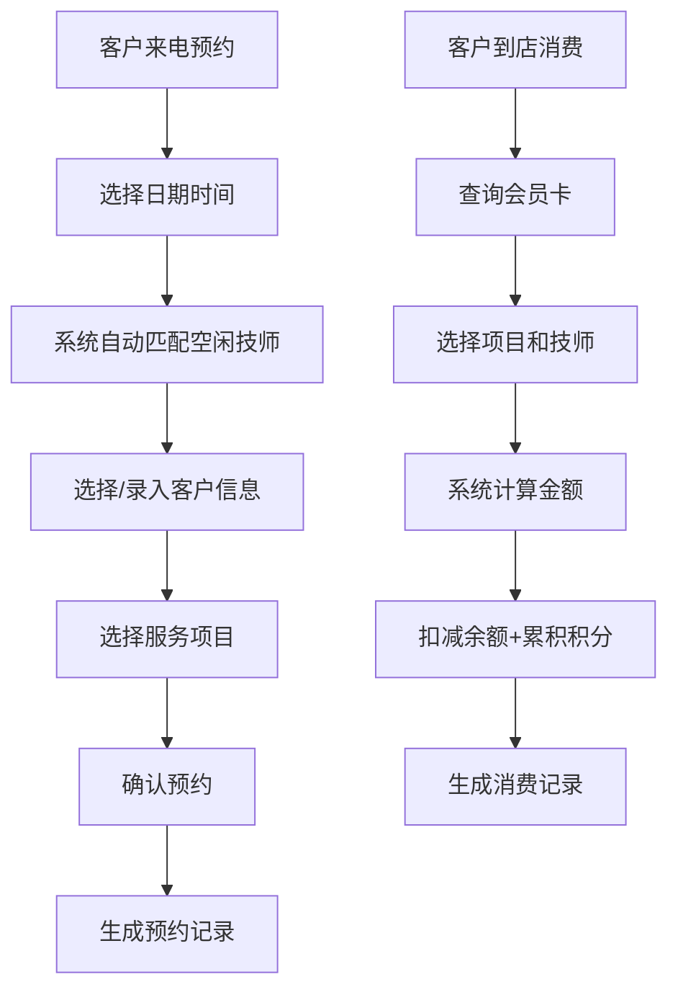

## 1. 产品概述

小型理发店管理系统，解决日常运营中的预约、会员、绩效、客户关怀等核心问题。目标用户为理发店老板和前台接待人员，帮助提升运营效率、客户留存率和经营数据透明度。

## 2. 核心功能

### 2.1 用户角色
| 角色 | 注册方式 | 核心权限 |
|------|----------|----------|
| 管理员（老板/前台） | 默认创建 | 所有功能：预约管理、会员管理、技师管理、统计报表、系统设置 |

### 2.2 功能模块
1. **首页仪表盘**：今日预约、待提醒生日、本月营收概览、快速操作入口
2. **预约管理**：预约日历、新建预约、技师排班、爽约记录
3. **会员管理**：会员列表、会员卡充值、消费记录、积分管理、生日提醒
4. **技师管理**：技师档案、服务项目、排班设置
5. **统计报表**：技师绩效、项目销量、充值统计、月度报表
6. **系统设置**：充值优惠规则、服务项目设置

### 2.3 页面详情
| 页面名称 | 模块名称 | 功能描述 |
|----------|----------|----------|
| 首页仪表盘 | 数据概览 | 今日预约数量、本月营收、会员数、待办事项 |
| 首页仪表盘 | 快速入口 | 新建预约、添加会员、快捷操作按钮 |
| 首页仪表盘 | 生日提醒 | 7天内生日客户列表，可发送关怀 |
| 预约管理 | 日历视图 | 按日期查看预约状态，时间段展示 |
| 预约管理 | 新建预约 | 选择客户、日期时间、自动匹配空闲技师、选择服务项目 |
| 预约管理 | 爽约处理 | 标记爽约，连续爽约2次自动预警 |
| 会员管理 | 会员列表 | 搜索、筛选、查看会员详情 |
| 会员管理 | 会员卡充值 | 按规则赠送金额，记录充值历史 |
| 会员管理 | 消费结算 | 扣减会员卡余额、自动累积积分 |
| 会员管理 | 客户偏好 | 记录发型偏好（如"剪短一点"、"留鬓角"） |
| 技师管理 | 技师档案 | 基本信息、擅长项目 |
| 技师管理 | 排班设置 | 设置技师工作时间 |
| 统计报表 | 技师绩效 | 服务客户数、营收排名 |
| 统计报表 | 项目销量 | 各服务项目销售数量与金额 |
| 统计报表 | 充值统计 | 月度充值金额、充值人数 |
| 系统设置 | 充值规则 | 自定义充X送Y规则 |
| 系统设置 | 服务项目 | 添加/编辑服务项目名称和价格 |

## 3. 核心流程

### 3.1 预约流程
客户打电话预约 → 前台选择日期时间 → 系统自动筛选该时段空闲技师 → 选择客户（或录入新客户）→ 选择服务项目 → 确认预约 → 系统生成预约记录

### 3.2 会员消费流程
客户到店消费 → 查询会员卡 → 选择服务项目和技师 → 系统计算金额 → 从会员卡余额扣减 → 自动累积积分（消费1元=1积分）→ 生成消费记录

### 3.3 会员充值流程
客户办理充值 → 选择充值档位（或自定义金额）→ 系统按规则自动计算赠送金额 → 充值到账 → 生成充值记录

## 4. 用户界面设计

### 4.1 设计风格
- **主色调**：深酒红色 `#7C2D12`，传递高端专业理发店气质
- **辅助色**：暖金色 `#D97706`，用于按钮高亮和重点数据
- **背景色**：暖米色 `#FEF3C7` / 深棕色 `#292524` 双主题可选
- **按钮风格**：圆角8px，悬浮阴影效果，渐变填充
- **字体**：标题使用优雅衬线字体（Noto Serif SC），正文使用现代无衬线字体（Noto Sans SC）
- **布局风格**：左侧导航 + 右侧内容区，卡片式信息展示
- **图标风格**：线性图标（lucide-react），统一线条粗细

### 4.2 页面设计概览
| 页面名称 | 模块名称 | UI元素 |
|----------|----------|--------|
| 首页仪表盘 | 数据概览 | 4个数据卡片（今日预约、本月营收、会员总数、待办），渐变背景，图标配数字 |
| 首页仪表盘 | 生日提醒 | 列表卡片，头像+姓名+生日天数+快捷操作按钮 |
| 预约管理 | 日历视图 | 周视图日历，时间轴+技师列，预约块彩色标记状态 |
| 预约管理 | 新建预约 | 模态框表单，分步选择日期→技师→客户→项目 |
| 会员管理 | 会员列表 | 表格+搜索筛选，卡片悬停效果，头像、余额、积分展示 |
| 统计报表 | 数据图表 | 柱状图（技师服务量）、饼图（项目占比）、折线图（月度趋势） |

### 4.3 响应式
桌面端优先设计（1280px+），同时适配平板（768px）和移动端（375px），侧边栏在移动端折叠为汉堡菜单。
