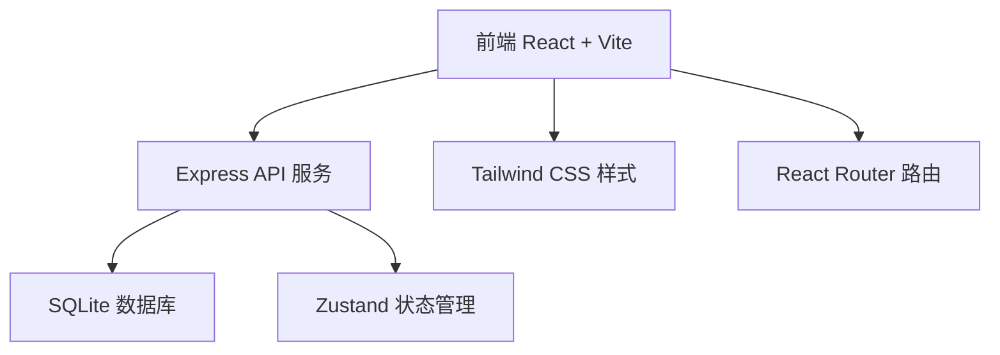
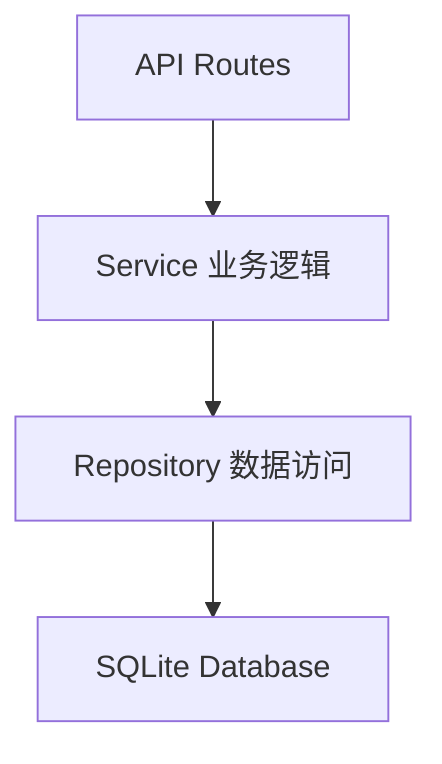
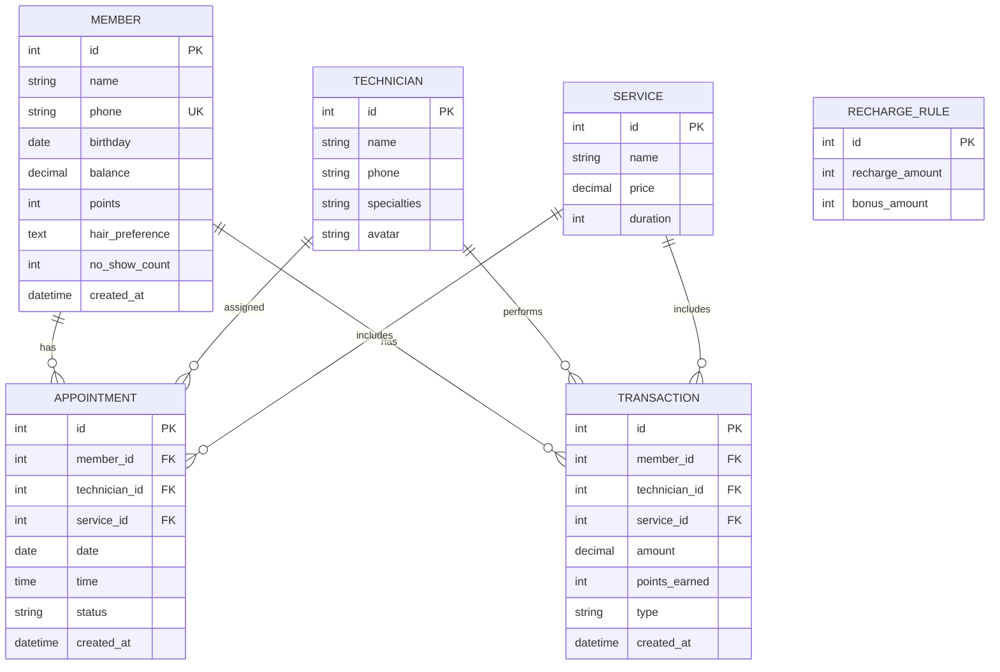

## 1. 架构设计



## 2. 技术描述
- **前端**：React@18 + TypeScript + TailwindCSS@3 + Vite
- **初始化工具**：vite-init
- **后端**：Express@4 + TypeScript
- **数据库**：SQLite（better-sqlite3），轻量级零配置，适合小型业务
- **状态管理**：Zustand
- **路由**：React Router DOM
- **图标**：lucide-react
- **图表**：recharts

## 3. 路由定义
| 路由 | 用途 |
|------|------|
| / | 首页仪表盘 |
| /appointments | 预约管理 |
| /appointments/new | 新建预约 |
| /members | 会员管理 |
| /members/:id | 会员详情 |
| /technicians | 技师管理 |
| /reports | 统计报表 |
| /settings | 系统设置 |

## 4. API 定义

### 4.1 类型定义
```typescript
// 客户/会员
interface Member {
  id: number;
  name: string;
  phone: string;
  birthday: string | null;
  balance: number;
  points: number;
  hairPreference: string | null;
  noShowCount: number;
  createdAt: string;
}

// 技师
interface Technician {
  id: number;
  name: string;
  phone: string;
  specialties: string;
  avatar: string | null;
}

// 服务项目
interface Service {
  id: number;
  name: string;
  price: number;
  duration: number; // 分钟
}

// 预约
interface Appointment {
  id: number;
  memberId: number;
  technicianId: number;
  serviceId: number;
  date: string; // YYYY-MM-DD
  time: string; // HH:mm
  status: 'pending' | 'completed' | 'no_show' | 'cancelled';
  createdAt: string;
}

// 消费记录
interface Transaction {
  id: number;
  memberId: number;
  technicianId: number;
  serviceId: number;
  amount: number;
  pointsEarned: number;
  type: 'consume' | 'recharge';
  createdAt: string;
}

// 充值规则
interface RechargeRule {
  id: number;
  rechargeAmount: number;
  bonusAmount: number;
}
```

### 4.2 接口列表
| 方法 | 路径 | 描述 |
|------|------|------|
| GET | /api/members | 获取会员列表 |
| GET | /api/members/:id | 获取会员详情 |
| POST | /api/members | 新增会员 |
| PUT | /api/members/:id | 更新会员信息 |
| POST | /api/members/:id/recharge | 会员充值 |
| POST | /api/members/:id/consume | 会员消费 |
| GET | /api/members/birthdays | 获取7天内生日会员 |
| GET | /api/technicians | 获取技师列表 |
| GET | /api/technicians/available | 获取指定时段空闲技师 |
| POST | /api/technicians | 新增技师 |
| GET | /api/services | 获取服务项目 |
| POST | /api/services | 新增服务项目 |
| GET | /api/appointments | 获取预约列表（支持日期筛选） |
| POST | /api/appointments | 新建预约 |
| PUT | /api/appointments/:id/status | 更新预约状态 |
| GET | /api/rules/recharge | 获取充值规则 |
| POST | /api/rules/recharge | 新增充值规则 |
| DELETE | /api/rules/recharge/:id | 删除充值规则 |
| GET | /api/reports/technicians | 技师绩效统计 |
| GET | /api/reports/services | 项目销量统计 |
| GET | /api/reports/recharge | 充值统计 |

## 5. 服务端架构



## 6. 数据模型

### 6.1 ER 图



### 6.2 初始化数据
- 默认充值规则：充200送30、充500送100、充1000送300
- 默认服务项目：剪发(58元/30min)、烫染(298元/120min)、护理(168元/60min)
- 默认技师：示例技师数据
